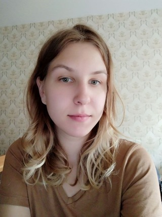

# CURRICULUM VITAE

## Anastasia Evsihneyeva

## Contacts
1. **GitHub** A-nastasi-a
2. **Discord** Anastasia_Evs (@A-nastasi-a) 
3. **Email** evsihneyeva@gmail.com
4. **Skype** e.stasy.d

## About me
My goal is to become a front-end programist. The best part of job of a programmist to me is to never ended learning. 
For me my strength are:
- interest in learning; 
- responsibility;
- purposefulness.

I have an experience of working in python as person who parses data from shop-sites. I wrote unit-tests on Django python and on Ruby on Rails. I create simple shop sites on Django.

## Skills
**Programming languages**
* Strong knowledge of Python. 
* Little experience with Ruby. 

**Frameworks**
Little work experience with Django and Django Rest Framework. 

**Version control**
Have experience of using Git, GitHub, GitLab.

**Operation systems**
Windows, Linux Ubuntu

**Databses**
SQLLite3, PostgreSQL

**Other**
Postman. 
Jira, Trello.

## Code examples
[GitHub](https://github.com/A-nastasi-a "My GitHub")

## Work experiense
***Itgenio*** - python tutor for children

*July 2018 - now*
* Teaching children with basics of Python 
* Teaching children with Scratch

***RocketData*** - software engineer

*January 2020 - March 2020*
* Coding web-parsers with python instruments: Requests and BeautifulSoup
* Checking and analysis of getting data

***Ingenious*** - software engineer

*October 2021 - December 2021*
* Wriring usit-tests for API
* Creating models and views for databases

## Education
***BNTU, Minsk*** - bachelor degree

*September 2015 - July 2020*

Faculty of Information Technologies and Robotic

Automation of technical processes and manufacturing

### Courses
***Udemy***

* Django A-Z: Build & Deploy Web Project With Python & Django
* Build REST APIs with Django REST Framework and Python

## English level
**Pre-Intermediate** (speaking, reading, writing)

* Streamline pre-intermediate course
* Streamline Intermediate course
